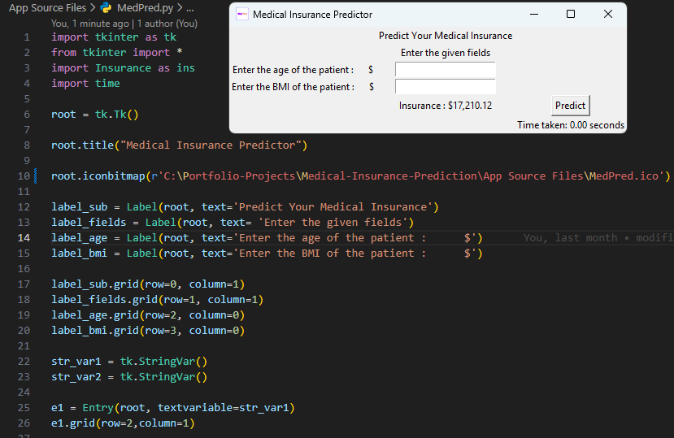

# Medical Insurance Prediction (MedPred)

[](https://www.python.org/)
[](https://scikit-learn.org/)
[](https://opensource.org/licenses/MIT)

## 📖 Table of Contents

- [Overview](#overview)
- [Features](#features)
- [Tech Stack](#tech-stack)
- [Installation](#installation)
- [Usage](#usage)
- [Model Details](#model-details)
- [Dataset](#dataset)
- [Build & Deployment](#build--deployment)
- [Screenshots](#screenshots)
- [Contributing](#contributing)
- [License](#license)

## Overview

MedPred is a machine learning application that predicts medical insurance costs based on patient age and BMI. It uses a linear regression model trained specifically on smoker data for accurate predictions. The project includes a Jupyter notebook for model development and a standalone Tkinter GUI app, packaged as a Windows executable.

## Features

- Predict insurance charges using age and BMI
- Trained on real insurance dataset
- Interactive GUI application
- Pre-built Windows executable (`App/MedPred.exe`)
- Model evaluation with MSE, R² scores
- Installer via Inno Setup (`App/MedPred setup.exe`)

## Tech Stack

| Category        | Technologies                   |
| --------------- | ------------------------------ |
| Language        | Python 3.8+                    |
| ML Framework    | scikit-learn 1.3+              |
| Data Processing | pandas 2.0+, NumPy 1.24+       |
| Visualization   | Matplotlib 3.7+, Seaborn 0.12+ |
| GUI             | Tkinter (standard lib)         |
| Packaging       | PyInstaller                    |
| Installer       | Inno Setup                     |

## Installation

1. Clone the repo:
   ```
   git clone <repo-url>
   cd Medical-Insurance-Prediction
   ```
2. Create virtual environment:
   ```
   python -m venv venv
   venv\\Scripts\\activate  # Windows
   ```
3. Install dependencies:
   ```
   pip install -r requirements.txt
   ```

## Usage

### Run the App

```bash
python "App Source Files/MedPred.py"
```

Or use pre-built executable: `App/MedPred.exe`

### Train/Explore Model

Open `Model/Insurance.ipynb` in Jupyter:

```bash
jupyter notebook Model/Insurance.ipynb
```

Enter age and BMI in the GUI to get predicted charges.

## Model Details

- **Target**: log-transformed insurance `charges` (then exp2 for dollars)
- **Features**: `age`, `bmi` (smokers only model for better accuracy)
- **Algorithm**: LinearRegression (with hyperparameter tuning via GridSearchCV on Ridge)
- **Performance**: Low MSE on train/test, R² ~0.8+ (see notebook)
- Prediction class in `App Source Files/Insurance.py`

## Dataset

- `Data/insurance.csv`: Kaggle dataset with age, sex, bmi, children, smoker, region, charges.
- Preprocessed: Dropped categorical, log transform charges, smoker filter.

## Build & Deployment

1. Build EXE with PyInstaller:
   ```
   pip install pyinstaller
   pyinstaller App Source Files/MedPred.spec
   ```
2. Create installer with Inno Setup using `App Source Files/script_inno.iss`.

## Screenshots



## Contributing

1. Fork the repo
2. Create branch: `git checkout -b feature-branch`
3. Commit: `git commit -m 'Add feature'`
4. Push: `git push origin feature-branch`
5. Open PR

## License

MIT License - see [LICENSE](LICENSE) for details.
